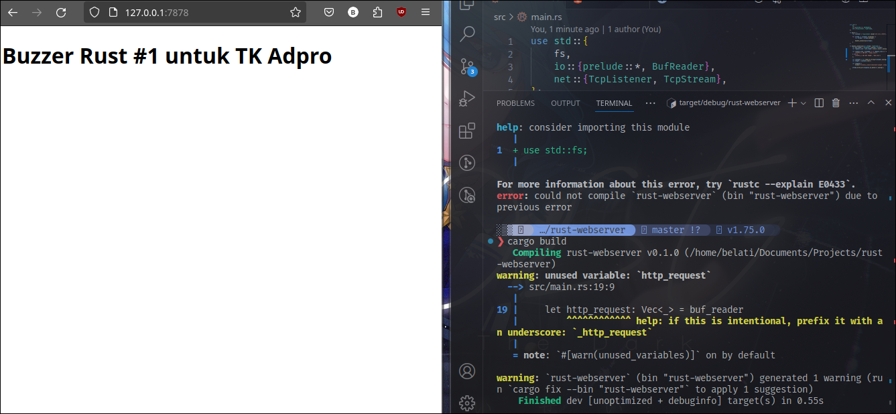

# Rust

## Commit 1: What does `handle_connection` do?
```rust
fn handle_connection(mut stream: TcpStream) {
    let buf_reader = BufReader::new(&mut stream);
    let http_request: Vec<_> = buf_reader
        .lines()
        .map(|result| result.unwrap())
        .take_while(|line| !line.is_empty())
        .collect();
    
    println!("Request: {:#?}", http_request);
}
```
At first, the modules `std::io::prelude` and `std::io::BufReader` are imported to let me read and write to the stream. In the `handle_connection` function, a new `BufReader` instance will be created that wraps a mutable reference to the `stream`. `BufReader` adds buffering by managing calls to the `std::io::Read` trait method. The variable `http_request` is made to collect lines of request the browser sends to the server. The `Vec<_>` type annotation indicates that these lines will be collected in a vector. 

`BufReader` implements `std::io::BufRead` trait, which provides the `lines` method, which returns an iterator of `Result<String, std::io::Error>` by splitting stream of data whenever it sees a newline byte. To get each `String`, each `Result` will be mapped then `unwrap`. The `Result` might be an error if the data isn't a valid UTF-8 or a problem is encountered when reading the stream. The program will be stopped for simplicity.

The browser signal signals the end of HTTP request by sending two newline characters in a row, so to get one request from the stream, new lines will be taken until a line with empty string is gotten.

## Commit 2:
```rust
fn handle_connection(mut stream: TcpStream) {
    // -- snip --

    let status_line = "HTTP/1.1 200 OK";
    let contents = fs::read_to_string("hello.html").unwrap();
    let length = contents.len();

    let response =
        format!("{status_line}\r\nContent-Length: {length}\r\n\r\n{contents}");

    stream.write_all(response.as_bytes()).unwrap();
}
```

The module `fs` is added to bring the standard library's filesystem into scope. One of it's use is to convert the content of a file into `String`. The `format!` macro is used to add the file's contents to the body of the success response. To ensure a valid HTTP response, `Content-Length` header is added which is set to the size of the response body.

Currently, the request data in `http_request` is ignored, so the `index.html` is sent unconditionally. Because of that, Rust shows this warning on compile time:

