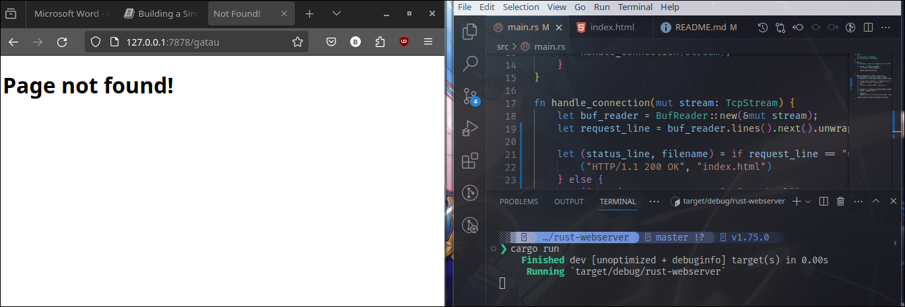
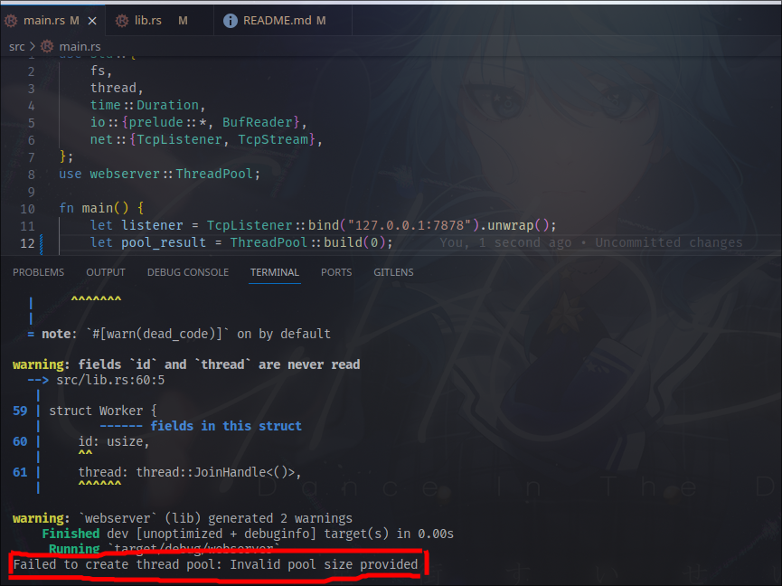

# Rust Multithreaded Server Miniproject

## Commit 1: What does `handle_connection` do?
```rust
fn handle_connection(mut stream: TcpStream) {
    let buf_reader = BufReader::new(&mut stream);
    let http_request: Vec<_> = buf_reader
        .lines()
        .map(|result| result.unwrap())
        .take_while(|line| !line.is_empty())
        .collect();
    
    println!("Request: {:#?}", http_request);
}
```
At first, the modules `std::io::prelude` and `std::io::BufReader` are imported to let me read and write to the stream. In the `handle_connection` function, a new `BufReader` instance will be created that wraps a mutable reference to the `stream`. `BufReader` adds buffering by managing calls to the `std::io::Read` trait method. The variable `http_request` is made to collect lines of request the browser sends to the server. The `Vec<_>` type annotation indicates that these lines will be collected in a vector. 

`BufReader` implements `std::io::BufRead` trait, which provides the `lines` method, which returns an iterator of `Result<String, std::io::Error>` by splitting stream of data whenever it sees a newline byte. To get each `String`, each `Result` will be mapped then `unwrap`. The `Result` might be an error if the data isn't a valid UTF-8 or a problem is encountered when reading the stream. The program will be stopped for simplicity.

The browser signal signals the end of HTTP request by sending two newline characters in a row, so to get one request from the stream, new lines will be taken until a line with empty string is gotten.

## Commit 2: Response in `handle_connection`
```rust
fn handle_connection(mut stream: TcpStream) {
    // -- snip --

    let status_line = "HTTP/1.1 200 OK";
    let contents = fs::read_to_string("hello.html").unwrap();
    let length = contents.len();

    let response =
        format!("{status_line}\r\nContent-Length: {length}\r\n\r\n{contents}");

    stream.write_all(response.as_bytes()).unwrap();
}
```

The module `fs` is added to bring the standard library's filesystem into scope. One of it's use is to convert the content of a file into `String`. The `format!` macro is used to add the file's contents to the body of the success response. To ensure a valid HTTP response, `Content-Length` header is added which is set to the size of the response body.

Currently, the request data in `http_request` is ignored, so the `index.html` is sent unconditionally. Because of that, Rust shows this warning on compile time:


## Commit 3: Selectively Responding
To split between response, `request_line`'s value need to be checked. Successful `GET` request will have their own `request_line`.

```rust
// --snip--
fn handle_connection(mut stream: TcpStream) {
    let buf_reader = BufReader::new(&mut stream);
    let request_line = buf_reader.lines().next().unwrap().unwrap();

    if request_line == "GET / HTTP/1.1" {
        // declare status_line, content, length, response for successful case
    } else {
        // declare status_line, content, length, response for unsuccessful case
    }
    // --snip--
}
```

The refactoring part is simple. Because on each branch, the same variables will be declared, then just use tuples to declare the two variables, that are `status_line` and `filename` based on the `request_line`. Then the `content` and `length` would only need to be written once. Hence, making the code cleaner.

```rust
fn handle_connection(mut stream: TcpStream) {
    // --snip--

    let (status_line, filename) = if request_line == "GET / HTTP/1.1" {
        ("HTTP/1.1 200 OK", "hello.html")
    } else {
        ("HTTP/1.1 404 NOT FOUND", "404.html")
    };

    // --snip--
}
```



## Commit 4: Slow Response Simulation
The server is only singlethreaded at the moment, so it could only serve one response at a time. It's a first come first served system, so it doesn't matter how long the time will take to serve a response, as long as they come first, they will be served first.

The server will slowly be jammed if many users received slow response. In that case, multithreading is needed to serve multiple users at once.

## Commit 5: Multithreaded Server
A thread pool is a group of spawned threads that are waiting and ready to handle a task. When the program receives a new task, it assigns one of the threads in the pool to the task, and that thread will process the task. The remaining threads in the pool are available to handle any other tasks that come in while the first thread is processing. 

When the first thread is done processing its task, it’s returned to the pool of idle threads, ready to handle a new task. A thread pool allows the server to process connections concurrently, increasing the throughput of the server.

## (Bonus) Replace `new` with `build`
Within the tutorial book, we were challenged to replace the `new` method with `build` method that returns `Result<ThreadPool, PoolCreationError>`. The intention here is to replace the unrecoverable error from `assert!` macro with something that can describe the error, probably.

```rust
impl ThreadPool {
    pub fn new(size: usize) -> ThreadPool {
        assert!(size > 0);
        // --snip--
    }
    // --snip--
}
```
To do so, I replace the `new` method with `build`, following the guide from the website. After that, I change the condition so if the size is `<=0`, then it will return an error of `InvalidSize`.

```rust
impl ThreadPool {
    pub fn build(size: usize) -> Result<ThreadPool, PoolCreationError> {
        if size <= 0 {
            return Err(PoolCreationError::InvalidSize);
        }
        // --snip--
    }
    // --snip--
}
```

Of course, I need to define what the error is. So I made an enum along with the display format for the errors in `PoolCreationError`. So far, I only made one only, that is for the `InvalidSize`.

```rust
use std::{
    // --snip--
    error,
    fmt,
};

#[derive(Debug)]
pub enum PoolCreationError {
    InvalidSize,
}

impl fmt::Display for PoolCreationError {
    fn fmt(&self, f: &mut fmt::Formatter<'_>) -> fmt::Result {
        match *self {
            PoolCreationError::InvalidSize => write!(f, "Invalid pool size provided"),
        }
    }
}

impl error::Error for PoolCreationError {}
```

A little tweaking is needed since the return type from the `build` method is different from the `new`. So the `pool` will be returned if and only if there are no error occured. If there are any errors, then the error message will be send and the program will be stopped.

```rust
fn main() {
    let listener = TcpListener::bind("127.0.0.1:7878").unwrap();
    let pool_result = ThreadPool::build(4);

    let pool = match pool_result {
        Ok(pool) => pool,
        Err(err) => {
            eprintln!("Failed to create thread pool: {}", err);
            return;
        }
    };

    for stream in listener.incoming() {
        let stream = stream.unwrap();

        pool.execute(|| {
            handle_connection(stream);
        });
    }
}
```

Here's the example output when `InvalidSize` is triggered.

